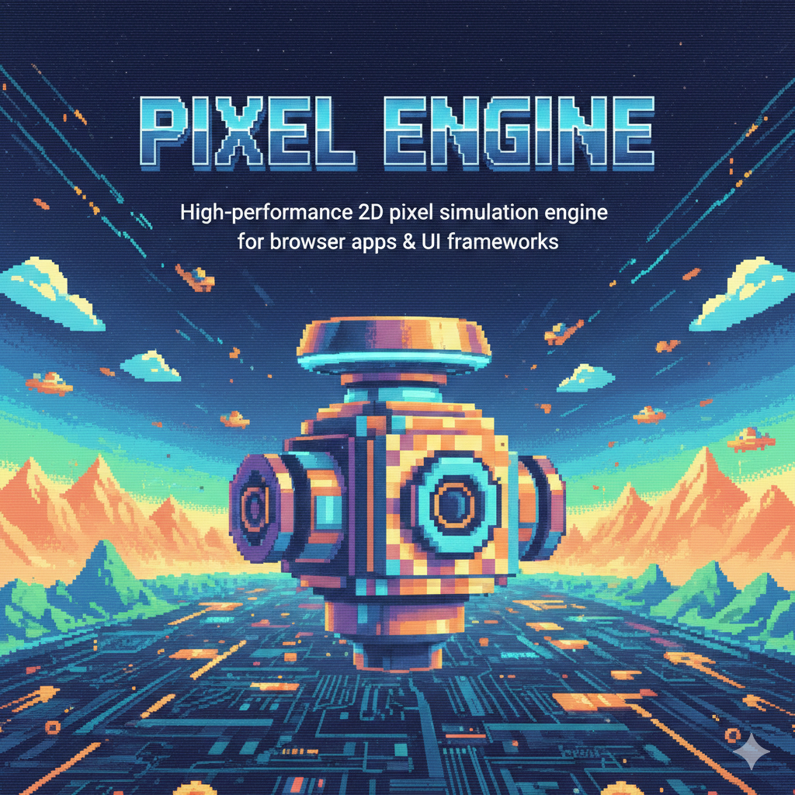

<p align="center">
  
</p>

# Pixel Engine

High-performance 2D pixel simulation engine for browser apps and modern UI frameworks.

Pixel Engine gives you a production-ready runtime (`@pixel-engine/core`), a powerful effect layer (`@pixel-engine/effects`), and a React integration package (`@pixel-engine/react`) to build interactive pixel surfaces fast.

## Why Pixel Engine

- Fast interactive pixel rendering with fixed-step runtime semantics.
- Flexible masks (text/image/hybrid) with timeline sequencing.
- Rich interactions: hover, ripple, magnetic hover, breathing, dissolve, shockwave, palette cycle.
- React-first DX with declarative components and hooks.
- Package split ready for scalable library use.

## Install

Recommended split packages:

```bash
npm install @pixel-engine/core @pixel-engine/effects @pixel-engine/react
```

Compatibility aggregate package:

```bash
npm install pixel-engine
```

## Quick Start (React)

```tsx
import { PixelGridCanvas } from "@pixel-engine/react";

export default function App() {
  return (
    <PixelGridCanvas
      width={900}
      height={520}
      preset="card-soft"
      onRipple={(e) => console.log("ripple", e.x, e.y)}
    />
  );
}
```

## Quick Start (Vanilla)

```ts
import { PixelEngine } from "@pixel-engine/core";
import { PixelGridEffect } from "@pixel-engine/effects";

const canvas = document.getElementById("app") as HTMLCanvasElement;
const width = 1000;
const height = 700;

const engine = new PixelEngine({ canvas, width, height });
const grid = new PixelGridEffect(engine, width, height, {
  colors: ["#334155", "#475569", "#64748b"],
  gap: 6,
  expandEase: 0.08,
  breathSpeed: 1
});

engine.addEntity(grid);
engine.start();
```

## React Usage by Complexity

### Easy

```tsx
<PixelGridCanvas width={900} height={520} preset="card-soft" />
```

### Medium

```tsx
<PixelGridCanvas
  width={900}
  height={520}
  preset="card-ripple"
  gridConfig={{ gap: 6, hoverEffects: { radius: 120 } }}
  scrollReactive={{ enabled: true, intensity: 1.1, direction: "both" }}
  sectionTransition={{ enabled: true, preset: "lift", amount: 28 }}
  statePreset={{ enabled: true, value: "active" }}
/>
```

### Advanced

```tsx
import catPngUrl from "./assets/cat.png";

<PixelGridCanvas
  width={960}
  height={540}
  preset="hero-image"
  mask={{
    type: "hybrid",
    initialMask: "image",
    items: [
      { type: "text", id: "title", text: "PIXEL", centerX: 480, centerY: 280, fontSize: 132, fontFamily: "Arial", fontWeight: 700 },
      { type: "image", id: "imgA", src: catPngUrl, centerX: 480, centerY: 260, scale: 2.05, sampleMode: "threshold" }
    ],
    steps: [
      { mask: "text", assetId: "title", holdMs: 1100, mode: "morph", durationMs: 700 },
      { mask: "image", assetId: "imgA", holdMs: 1000, mode: "fade", durationMs: 450 }
    ],
    maskTimeline: { enabled: true, autoplay: true, loop: true, initialStep: 0 }
  }}
  themeSync={{ enabled: true, mode: "brand", brandColors: ["#0f766e", "#14b8a6", "#2dd4bf"] }}
  debugHud={{ enabled: true, position: "top-right", updateIntervalMs: 180 }}
  ssrPlaceholder={{ enabled: true, preset: "hero-image", hideOnReady: true }}
/>
```

For complete prop/hook option tables, go to `API.md`.

## React Surface Components

| Component | Primary use |
|---|---|
| `PixelCanvas` | Low-level engine canvas |
| `PixelGridCanvas` | Fastest declarative PixelGrid integration |
| `PixelSurface` | Canvas + overlay content layout |
| `PixelCard` | Reusable interactive card primitive |

Overlay behavior:
- `overlayPointerEvents="none"`: overlay does not block canvas interactions.
- `overlayPointerEvents="auto"`: overlay handles pointer input.
- `overlayPointerEvents="hybrid"`: overlay stays interactive and pointer bridge forwards interactions to canvas effects.

## Package Split

- `@pixel-engine/core`: engine lifecycle, loop, scene, renderers, input.
- `@pixel-engine/effects`: `PixelGridEffect`, masks, influences, timeline runtime.
- `@pixel-engine/react`: hooks/components/helpers for declarative integration.

## Documentation Map

- Public API and examples: `API.md`
- Migration notes: `MIGRATION.md`
- Release notes: `CHANGELOG.md`
- Benchmarks: `BENCHMARKS.md`
- Release workflow: `RELEASE.md`
- Release checklist: `RELEASE_CHECKLIST.md`

## Architecture

- `core`: engine lifecycle, loop, timing.
- `scene`: entity update/render traversal.
- `renderers`: abstraction + Canvas2D implementation.
- `influences`: reusable influence primitives.
- `entities`: high-level effects (`PixelGridEffect`).
- `entities/pixel-grid/internal`: private runtime modules (not public API).

## Development Scripts

- `npm run dev`: run playground with Vite.
- `npm run test`: run Vitest.
- `npm run lint`: ESLint checks.
- `npm run format`: apply Prettier formatting.
- `npm run typecheck`: TypeScript checks (`tsc --noEmit`).
- `npm run build`: build aggregate package.
- `npm run build:packages`: build `@pixel-engine/core`, `@pixel-engine/effects`, `@pixel-engine/react`.
- `npm run build:all`: build packages + aggregate.
- `npm run verify`: lint + tests + build + typecheck.
- `npm run bench:pixelgrid`: PixelGrid benchmark suite.
- `npm run release:check`: full pre-release verification.

## Runtime Notes

- Fixed timestep loop with tunable runtime profile.
- `PixelGridEffect` supports `resize(width, height)`.
- React wrappers recreate effect instances automatically when resolved `gridConfig` or `influenceOptions` changes.
- Use `effectKey` only when you need an explicit remount/reset boundary.

## Project Status

- Stable API baseline for core runtime + `PixelGridEffect`.
- v1.1 Phase 1 to Phase 10 completed.
- Current focus: v1.2 planning backlog and next feature set.

## License

MIT
